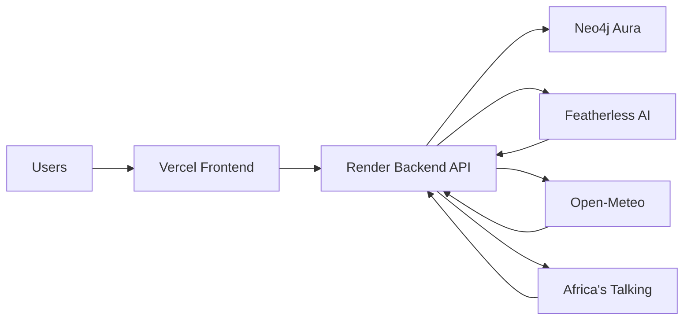

# KaLI Deployment Guide

How to run KaLI locally and deploy to production (Vercel + Render + Neo4j Aura).

---

## Local development

### Prerequisites

- Node.js 20+
- Neo4j 5 (Docker or Aura)
- `FEATHERLESS_API_KEY` (optional but recommended)

### 1. Environment

```bash
cp .env.example .env
cp frontend/.env.example frontend/.env
```

**Root / backend `.env`:**

```env
NEO4J_URI=bolt://localhost:7687
NEO4J_USER=neo4j
NEO4J_PASSWORD=kali-dev-password
API_CORE_PORT=4000
CORS_ORIGIN=http://localhost:3000,http://localhost:5173
JWT_SECRET=change-me-in-production
FEATHERLESS_API_KEY=your-key
GROUND_TRUTH_SCORE_BONUS=8
OPEN_METEO_ENABLED=true
```

**`frontend/.env`:**

```env
VITE_API_CORE_URL=http://localhost:4000
```

### 2. Neo4j + seed

```bash
npm run neo4j:up
npm run neo4j:seed
npm run seed:uganda    # optional Uganda zones
npm run seed:extra     # demo farmers incl. KTDA-43456789
```

### 3. Run services

```bash
# Terminal 1
cd backend && npm run dev    # port 4000

# Terminal 2 (repo root)
npm run dev                  # port 3000
```

### 4. Climate alerts (ground-truth demo)

```bash
cd backend && npm run climate:sync
```

---

## Production architecture



| Service | Host | Branch |
|---------|------|--------|
| Frontend | Vercel (`kali-lending.vercel.app`) | `Feature` or `main` |
| Backend | Render (`kaliapp-api.onrender.com`) | `Feature` or `main` |
| Database | Neo4j Aura | — |

---

## Vercel (frontend)

### Environment variables

| Variable | Value |
|----------|-------|
| `VITE_API_CORE_URL` | `https://kaliapp-api.onrender.com` |

### Build settings

- Framework: Vite / TanStack Start
- Root: `frontend` (or monorepo config per `vercel.json`)
- Build: `npm run build`

Redeploy after merging `Feature` branch.

---

## Render (backend)

### Environment variables

| Variable | Value |
|----------|-------|
| `NEO4J_URI` | `neo4j+s://....databases.neo4j.io` |
| `NEO4J_USER` | `neo4j` |
| `NEO4J_PASSWORD` | *(Aura password)* |
| `CORS_ORIGIN` | `https://kali-lending.vercel.app` |
| `JWT_SECRET` | *(long random string)* |
| `FEATHERLESS_API_KEY` | *(API key)* |
| `GROUND_TRUTH_SCORE_BONUS` | `8` |
| `OPEN_METEO_ENABLED` | `true` |

### Start command

```bash
cd backend && npm start
```

### Post-deploy

1. Verify `GET https://kaliapp-api.onrender.com/api/health`
2. Run seed scripts against Aura if graph is empty
3. Trigger climate sync via `POST /api/pipeline/sync` (officer JWT)

---

## Neo4j Aura

1. Create AuraDB instance (free tier works for demos)
2. Copy connection URI to `NEO4J_URI`
3. Run seeds from local machine pointing at Aura:

```bash
cd backend
NEO4J_URI=neo4j+s://... node scripts/seed.js
node scripts/seed-uganda.js
node scripts/patch-ktda.js
```

---

## Smoke test checklist

| Check | URL / action |
|-------|----------------|
| API health | `GET /api/health` → `status: ok` |
| Farmer readiness | `GET /api/readiness/KTDA-43456789` |
| Officer login | `POST /api/auth/login` |
| Dashboard | `/dashboard` loads queue |
| Agronomist | `/agronomist` shows queue after farmer completes action |
| Map | `/map` pins render |

---

## Troubleshooting

| Symptom | Fix |
|---------|-----|
| Readiness 500 / timeout | Check Neo4j; Featherless may be slow on first load |
| CORS errors | Add frontend origin to `CORS_ORIGIN` |
| 401 on dashboard | Re-login at `/auth` |
| Empty agronomist queue | Farmer must complete readiness action first |
| No climate bonus | Run `climate:sync`; verify active `ClimateAlert` |
| Backend stuck on old crash | Restart `npm run dev`; check port 4000 not duplicated |

---

## Security notes

- Never commit `backend/.env` or Aura credentials
- Rotate `JWT_SECRET` in production
- Use Africa's Talking production keys only on deployed backend
- Farmer readiness routes are public by design — rate-limit in production
