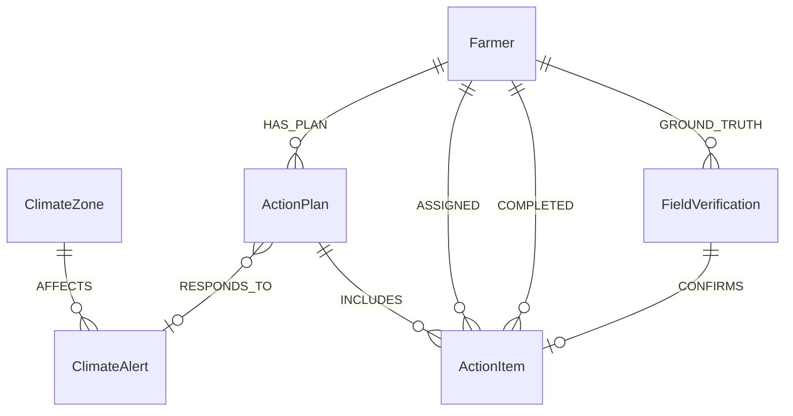

# Ground Truth Loop

How KaLI connects **macro climate intelligence** to **micro field verification** and **credit outcomes**.


---

## Why this exists

Climate advisories are zone-level: *"Kericho tea belt — drought stress, mulch and protect inputs."*

Credit underwriting is individual: *"Did **this** farmer respond?"*

Without verification, lenders can penalize climate risk but cannot reward mitigation. The ground-truth loop closes that gap.

---

## Graph model

| Node | Purpose |
|------|---------|
| `ClimateAlert` | Active macro advisory for a zone |
| `ActionPlan` | Farmer's response plan snapshot |
| `ActionItem` | Single advisory action (mulch, pest traps, etc.) |
| `FieldVerification` | Agronomist attestation on farm |

| Relationship | Meaning |
|--------------|---------|
| `ClimateAlert -[:AFFECTS]-> ClimateZone` | Alert applies to zone |
| `Farmer -[:HAS_PLAN]-> ActionPlan` | Farmer has active plan |
| `ActionPlan -[:INCLUDES]-> ActionItem` | Plan contains actions |
| `Farmer -[:ASSIGNED]-> ActionItem` | Farmer responsible |
| `Farmer -[:COMPLETED]-> ActionItem` | Self-reported done |
| `Farmer -[:GROUND_TRUTH]-> FieldVerification` | Officer visit record |
| `FieldVerification -[:CONFIRMS]-> ActionItem` | Verified on farm |



---

## Lifecycle

### 1. Macro advisory issued

**Service:** `climatePipeline.js` → `upsertClimateAlert()`

When climate sync detects advisory-worthy conditions (low SPI, pest proximity, weather anomaly), a `ClimateAlert` node is created and linked to the `ClimateZone`.

### 2. Action plan synced

**Service:** `readinessService.js` → `syncActionPlan()`

When a farmer opens My Readiness:

- Featherless or drag-based actions become `ActionItem` nodes
- Plan links to active `ClimateAlert` when present

### 3. Farmer self-reports

**API:** `POST /api/readiness/:lookup/actions/:actionId/complete`

Creates `COMPLETED` edge with `self_reported: true`.

### 4. Agronomist verifies

**API:** `POST /api/farmers/:id/verify-field`

**UI:** `/agronomist` Field Intelligence platform

Creates `FieldVerification` node and `CONFIRMS` edge. Marks action as `verified: true`.

### 5. Credit synthesis

**Service:** `scoringEngine.js` → `getMitigationBonus()`

Bonus applied when **both**:

- Active `ClimateAlert` in farmer's zone (via co-op path)
- At least one `FieldVerification` confirming an action

Default bonus: **+8 points** (`GROUND_TRUTH_SCORE_BONUS` env var).

Driver label: *"Ground-truth mitigation verified"*

---

## ML visit prioritization

**Service:** `agronomistMlService.js`

Agronomists see farmers ranked by **visit priority score** (0–100), not just FIFO.

| Feature | Weight direction |
|---------|------------------|
| Active zone alert | ↑ priority |
| Unverified self-reported actions | ↑ priority |
| SPI drought stress | ↑ priority |
| Pest proximity | ↑ priority |
| Credit refer/decline band | ↑ priority |
| Long co-op history | ↓ slightly (trust offset) |

Tiers: **urgent** (≥70) · **soon** (≥45) · **routine**

---

## API summary

| Method | Path | Role |
|--------|------|------|
| `GET` | `/api/readiness/:lookup` | Farmer portal |
| `POST` | `/api/readiness/:lookup/actions/:id/complete` | Self-report |
| `GET` | `/api/agronomist/queue` | ML-ranked queue |
| `GET` | `/api/agronomist/insight/:farmerId` | Field panel detail |
| `POST` | `/api/farmers/:id/verify-field` | Record verification |
| `POST` | `/api/verify` | Public demo verify by lookup |

---

## Configuration

```env
GROUND_TRUTH_SCORE_BONUS=8
```

Run climate sync to seed alerts:

```bash
cd backend && npm run climate:sync
```

---

## What this is NOT

- Not a full farm management system (Shambapro-style)
- Not satellite change detection (future integration point)
- Not a replacement for co-op delivery records

It is the **minimum credible bridge** between advisory and credit.

---

## Demo checklist

- [ ] Run `climate:sync` so zones have active alerts
- [ ] Farmer completes action at `/readiness` with `KTDA-43456789`
- [ ] Agronomist sees farmer in `/agronomist` queue
- [ ] Verify action → scorecard shows +8 driver
