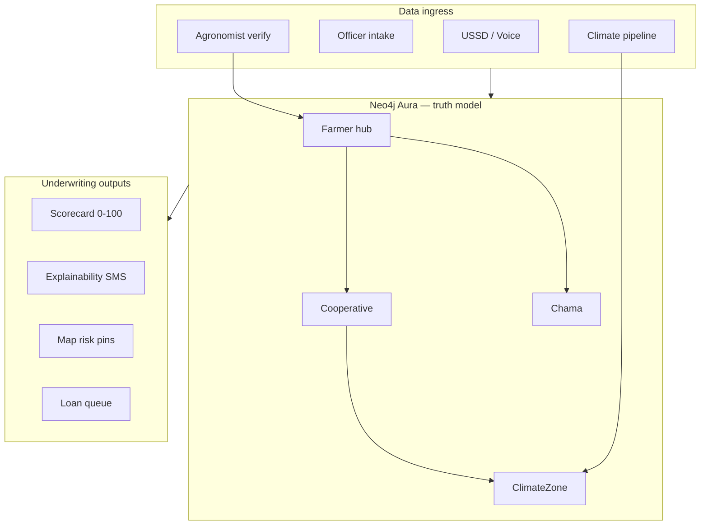
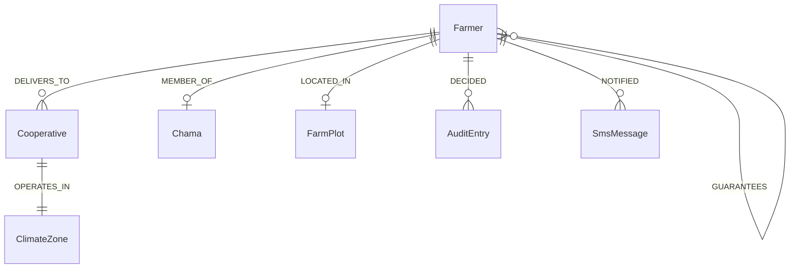
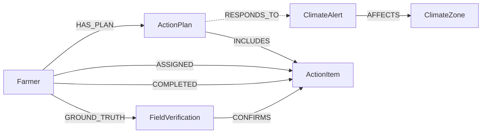
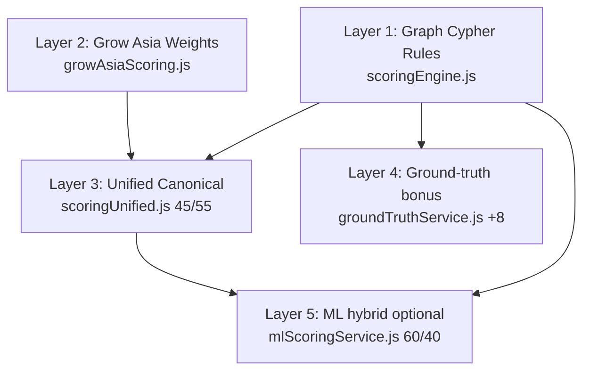

# KaLI Neo4j Graph Engine — Technical Deep Dive

> **How KaLI uses Neo4j as the core underwriting brain** — not as a cache, not as a sidecar, but as the **truth model** for agricultural credit in East Africa.

This document is written for judges, technical reviewers, and engineers evaluating why a **property graph** is the right foundation for climate-smart, explainable smallholder lending.


---

## Table of contents

1. [The problem with relational credit](#1-the-problem-with-relational-credit)
2. [Why Neo4j for KaLI](#2-why-neo4j-for-kali)
3. [Graph schema — nodes and relationships](#3-graph-schema--nodes-and-relationships)
4. [Single-pass underwriting traversal](#4-single-pass-underwriting-traversal)
5. [Scoring algorithm evolution](#5-scoring-algorithm-evolution)
6. [Climate contagion](#6-climate-contagion)
7. [Ground-truth graph extension](#7-ground-truth-graph-extension)
8. [Grow Asia Cypher layer](#8-grow-asia-cypher-layer)
9. [Unified canonical score](#9-unified-canonical-score)
10. [Write paths and audit trail](#10-write-paths-and-audit-trail)
11. [Map and portfolio queries](#11-map-and-portfolio-queries)
12. [Indexes and constraints](#12-indexes-and-constraints)
13. [Improvements over baseline approaches](#13-improvements-over-baseline-approaches)
14. [Live Cypher cookbook](#14-live-cypher-cookbook)

---

## 1. The problem with relational credit

Traditional ag-lending systems store farmers in one table, cooperatives in another, weather in a third. To answer:

> *"What is Mary Wanjiku's credit risk given her chama, her co-op's climate zone, and her peer guarantor?"*

…a relational stack needs **4–6 JOINs**, often across siloed databases. Worse:

| Relational pain | Graph advantage |
|-----------------|-----------------|
| Climate updates require batch ETL per farmer | Update **one** `ClimateZone` node → all connected farmers inherit risk on next traversal |
| Peer guarantees are hard to query recursively | `[:GUARANTEES]` is a first-class edge — one `OPTIONAL MATCH` |
| Explainability is reconstructed from joins | Drivers/drags are **paths** — "Chama → repayment rate → +15" is traceable |
| USSD ingest + officer decision + SMS are separate tables | All are **nodes and edges** on the same `Farmer` hub |

KaLI's bet: **credit is a network property**, not a row property.

---

## 2. Why Neo4j for KaLI



### Design principles

1. **Farmer-centric hub** — every signal radiates from or returns to `(:Farmer)`.
2. **Traverse, don't join** — one Cypher query gathers co-op, chama, climate, plot, peers.
3. **Climate as shared infrastructure** — zones are nodes, not duplicated weather columns per farmer.
4. **Explainability by construction** — scoring code records *which graph signal* caused each ±point.
5. **Append-only audit** — decisions and SMS are new nodes, never overwritten rows.

### Stack integration

| Component | File | Neo4j role |
|-----------|------|------------|
| Driver singleton | `backend/src/config/neo4j.js` | Connection pool to Aura/local |
| Core scoring | `backend/src/services/scoringEngine.js` | Single-pass traversal + rules |
| Grow Asia weights | `backend/src/services/growAsiaScoring.js` | In-query weighted sum (0–1) |
| Unified blend | `backend/src/services/scoringUnified.js` | Canonical 45/55 merge |
| Climate sync | `backend/src/services/climatePipeline.js` | Zone mutation + alert promotion |
| Ground truth | `backend/src/services/groundTruthService.js` | Advisory → verify → bonus |
| Map pins | `backend/src/services/mapService.js` | Portfolio-wide traversal |
| Seeds | `database/seed.cypher` | Topology bootstrap |

---

## 3. Graph schema — nodes and relationships

### Core credit topology



### Node catalog

| Label | Key properties | Role |
|-------|----------------|------|
| `Farmer` | `id`, `national_id`, `ktda_id`, `phone_number`, `demographic_group`, `has_land_ownership`, `lease_duration_months`, `chama_months_consistent`, `mobile_money_inflows_kes`, `status` | Applicant hub |
| `Cooperative` | `id`, `name` | Supply-chain anchor |
| `ClimateZone` | `id`, `name`, `current_spi_index`, `pest_proximity_km`, `rainfall_mm_last_30d`, `advisory`, `last_sync_iso` | Shared climate risk |
| `Chama` | `id`, `name`, `repayment_rate_pct`, `status` | Social collateral |
| `FarmPlot` | `id`, `acreage` | Land productivity signal |
| `AuditEntry` | `decision`, `stance`, `notes`, `officer`, `score`, `timestamp_iso` | Underwriting journal |
| `SmsMessage` | `body`, `category`, `sent_iso` | Farmer notification log |
| `PipelineRun` | `source`, `status`, `message`, `last_run_iso` | ETL audit |

### Ground-truth extension (v2)

| Label | Role |
|-------|------|
| `ClimateAlert` | Versioned macro advisory linked to zone |
| `ActionPlan` | Farmer's synced response plan |
| `ActionItem` | Single mitigation action |
| `FieldVerification` | Agronomist attestation |



### Relationship properties

| Relationship | Properties | Used in scoring |
|--------------|------------|-----------------|
| `DELIVERS_TO` | `delivery_years`, `volume_tons`, `consistency_score` | +8 to +15 drivers; asset substitute |
| `MEMBER_OF` | — | Chama node properties |
| `GUARANTEES` | — | Peer trust propagation (+10) |
| `OPERATES_IN` | — | Climate contagion path |
| `COMPLETED` | `completed_iso`, `self_reported`, `verified` | Ground-truth loop |
| `DECIDED` | `at` | Audit timestamp |

---

## 4. Single-pass underwriting traversal

The heart of KaLI is **`calculateGraphScore()`** in `scoringEngine.js`. One query walks the farmer's network:

```cypher
MATCH (f:Farmer)
WHERE f.id = $lookup OR f.national_id = $lookup

OPTIONAL MATCH (f)-[del:DELIVERS_TO]->(coop:Cooperative)-[:OPERATES_IN]->(zone:ClimateZone)
OPTIONAL MATCH (f)-[:MEMBER_OF]->(chama:Chama)
OPTIONAL MATCH (f)<-[:GUARANTEES]-(peer:Farmer)
  WHERE peer.credit_standing = "Excellent"
OPTIONAL MATCH (f)-[:LOCATED_IN]->(plot:FarmPlot)

RETURN
  f AS farmer,
  del AS coop_metrics,
  coop AS cooperative,
  zone AS climate,
  chama AS social,
  plot AS farm_plot,
  count(peer) > 0 AS is_guaranteed
```

### Why single-pass matters

| Approach | Round trips | Explainability |
|----------|-------------|----------------|
| REST microservices (farmer + weather + co-op APIs) | 3–5 | Manual correlation |
| SQL with JOINs | 1 | Hidden in query plan |
| **KaLI Cypher traversal** | **1** | **Explicit drivers/drags array** |

JavaScript applies a **transparent rule engine** on graph results (not a black-box ML model alone):

- Base score: **50**
- Each rule pushes to `drivers[]` or `drags[]` with `label`, `points`, `detail`
- Final: `clamp(score, 0, 100)` → band Approve / Refer / Decline

This separation — **graph fetch in Cypher, rules in JS** — keeps the algorithm auditable for regulators and cooperative boards.

---

## 5. Scoring algorithm evolution

KaLI did not ship one score. It evolved **four layers** that compose:



### Layer 1 — Graph rule engine (0–100)

| Signal | Source path | Points |
|--------|-------------|--------|
| Co-op delivery ≥ 3 years | `DELIVERS_TO.delivery_years` | +15 |
| Co-op delivery ≥ 1 year | same | +8 |
| No co-op history | same | −10 |
| Chama repayment ≥ 95% | `MEMBER_OF` → Chama | +15 |
| Chama repayment ≥ 85% | same | +8 |
| Peer guarantee | `<-[:GUARANTEES]-` Excellent peer | +10 |
| Land ownership | Farmer property | +10 |
| Lease ≥ 24 months (asset substitute) | Farmer property | +15 |
| Co-op ≥ 2y substitutes collateral | `DELIVERS_TO` | +10 |
| No collateral path | — | −12 |
| Chama savings ≥ 18 months | Farmer property | +12 |
| M-Pesa inflows ≥ 100k KES | Farmer property | +10 |
| Thin M-Pesa | Farmer property | −5 |
| SPI ≤ −1.5 (severe drought) | `Coop → ClimateZone` | −15 |
| SPI ≤ −1.0 | same | −15 |
| SPI ≤ −0.5 | same | −6 |
| SPI ≥ 0.5 (favourable) | same | +6 |
| Pest ≤ 15 km | ClimateZone | −10 |
| Pest < 25 km | same | −8 |

### Layer 2 — Grow Asia in-graph weights (0–1)

Weights are computed **inside Cypher** — supply chain, social, climate, stability:

```cypher
coalesce(d.consistency_score, toFloat(coalesce(d.delivery_years, 0)) / 5.0) * 0.45 AS supply_chain_weight,
(CASE WHEN ch.repayment_rate_pct >= 90 THEN 0.25 ... END) + (guaranteeCount * 0.10) AS social_weight,
CASE WHEN cz.current_spi_index > -1.0 THEN 0.10 ELSE 0.02 END AS climate_weight,
...
```

Risk tier: **green** (≥0.65 & SPI ok) · **amber** · **red** (<0.45 or SPI ≤ −1.5).

### Layer 3 — Unified canonical score

```javascript
canonical = round(growAsiaPercent * 0.45 + graphScore * 0.55)
```

Grow Asia brings **SAFIRA/supply-chain framing**; KaLI graph brings **East Africa field reality** (lease substitutes, M-Pesa, pest km). Neither alone is sufficient.

### Layer 4 — Ground-truth mitigation (+8)

Second Cypher query in `getMitigationBonus()`:

```cypher
MATCH (f:Farmer {id: $farmerId})
OPTIONAL MATCH (f)-[:DELIVERS_TO]->(:Cooperative)-[:OPERATES_IN]->(z:ClimateZone)
OPTIONAL MATCH (z)<-[:AFFECTS]-(alert:ClimateAlert {active: true})
OPTIONAL MATCH (f)-[:GROUND_TRUTH]->(v:FieldVerification)-[:CONFIRMS]->(:ActionItem)
WHERE alert IS NOT NULL
RETURN count(DISTINCT alert) > 0 AS hadActiveAlert,
       count(DISTINCT v) AS verifiedCount
```

Bonus applies only when **macro alert exists AND field verification exists** — closing the advisory-credit gap.

### Layer 5 — ML hybrid (scorecard display)

Logistic regression on graph-extracted features blends **60% graph / 40% ML** for approve probability. Graph remains primary; ML is augmentation, not replacement.

---

## 6. Climate contagion

Climate risk in KaLI is **not copied per farmer**. It lives on `ClimateZone` and propagates through cooperatives:

```
Farmer ──DELIVERS_TO──► Cooperative ──OPERATES_IN──► ClimateZone
                                                      ↑
                                            SPI, pest, advisory
```

### Pipeline (`climatePipeline.js`)

1. `MATCH (z:ClimateZone)` — read all zones
2. Fetch Open-Meteo precipitation per zone coordinates
3. Recompute SPI from 30-day rainfall series
4. `SET` zone properties in place
5. If advisory warranted → `CREATE ClimateAlert` node
6. Promote farmers: `awaiting_climate` → `ready_for_review` when zone path exists

**One zone update affects every farmer on that cooperative hub** — without touching farmer rows. This is the defining graph pattern for ag-climate credit.

### Demo: change risk live in Neo4j Browser

```cypher
MATCH (z:ClimateZone {id: "KE-RIFT-04"})
SET z.current_spi_index = -2.0,
    z.advisory = "Emergency drought — input credit freeze"
```

Reload scorecard for any Naivasha co-op farmer — drags update immediately.

---

## 7. Ground-truth graph extension


Traditional climate APIs inform advisories but not credit. KaLI's graph extension:

| Step | Graph operation |
|------|-----------------|
| Advisory issued | `CREATE (a:ClimateAlert)-[:AFFECTS]->(z)` |
| Readiness load | `MERGE ActionPlan`, `MERGE ActionItem`, link `RESPONDS_TO` alert |
| Farmer ticks action | `MERGE (f)-[:COMPLETED]->(item)` |
| Agronomist verifies | `CREATE FieldVerification`, `CONFIRMS` edge |
| Score refresh | `getMitigationBonus()` → +8 driver |

Agronomist queue query (pending verification):

```cypher
MATCH (f:Farmer)-[:ASSIGNED]->(item:ActionItem)
OPTIONAL MATCH (f)-[done:COMPLETED]->(item)
OPTIONAL MATCH (v:FieldVerification)-[:CONFIRMS]->(item)
WITH f, item, done, v
WHERE done IS NOT NULL AND v IS NULL
RETURN f, collect(item) AS pendingItems
```

---

## 8. Grow Asia Cypher layer

Grow Asia scoring runs a **parallel traversal** optimized for phone/USSD lookup:

```cypher
MATCH (f:Farmer)
WHERE replace(f.phone_number, ' ', '') ENDS WITH right($phone, 9)
   OR f.id = $lookup OR f.national_id = $lookup
OPTIONAL MATCH (f)-[d:DELIVERS_TO]->(c:Cooperative)
OPTIONAL MATCH (f)-[:MEMBER_OF]->(ch:Chama)
OPTIONAL MATCH (f)-[g:GUARANTEES]-(peer:Farmer)
OPTIONAL MATCH (f)-[:DELIVERS_TO]->(:Cooperative)-[:OPERATES_IN]->(cz:ClimateZone)
```

Weights sum to `systemScore` ∈ [0, 1]. Used by:
- Scorecard `grow_asia` panel
- Map pin risk tier coloring
- Unified canonical score (45% weight)

---

## 9. Unified canonical score

```javascript
// scoringUnified.js
canonical_score = round(growAsiaPercent * 0.45 + graphScore * 0.55)
```

| Condition | Band |
|-----------|------|
| Grow Asia ≥ 0.65 **OR** graph ≥ 65 | Approve |
| Grow Asia < 0.45 **AND** graph < 50 | Decline |
| Otherwise | Refer |

**Why blend?** Grow Asia encodes supply-chain finance conventions; KaLI graph encodes Kenyan field signals (lease-as-collateral, M-Pesa, peer guarantee). The graph prevents false negatives for women leaseholders; Grow Asia prevents false positives for thin social ties.

---

## 10. Write paths and audit trail

### Officer decision

```cypher
MATCH (f:Farmer {id: $farmerId})
CREATE (a:AuditEntry { decision: $decision, stance: $stance, ... })
CREATE (f)-[:DECIDED {at: datetime()}]->(a)
CREATE (sms:SmsMessage { body: $smsBody, ... })
CREATE (f)-[:NOTIFIED]->(sms)
```

Every decision is an **immutable node** — full audit for CBK-style compliance reviews.

### USSD / ingest

`MERGE (f:Farmer {national_id: $id})` with `ON CREATE SET` — idempotent farmer creation. Links to cooperative and default chama in same transaction.

### Climate pipeline

`SET` on zone nodes + `MERGE PipelineRun` — operational telemetry without polluting farmer properties.

---

## 11. Map and portfolio queries

### Map — all farmers with risk context

```cypher
MATCH (f:Farmer)
OPTIONAL MATCH (f)-[d:DELIVERS_TO]->(coop:Cooperative)
OPTIONAL MATCH (coop)-[:OPERATES_IN]->(zone:ClimateZone)
OPTIONAL MATCH (f)-[:MEMBER_OF]->(ch:Chama)
OPTIONAL MATCH (f)-[g:GUARANTEES]-(peer:Farmer)
WITH f, d, coop, zone, ch, count(DISTINCT g) AS guaranteeCount
RETURN f, d, coop, zone, ch, guaranteeCount
```

Grow Asia weights computed per record in JS → pin color (green/amber/red).

### Dashboard queue

```cypher
MATCH (f:Farmer)
OPTIONAL MATCH (f)-[:DELIVERS_TO]->(coop:Cooperative)
OPTIONAL MATCH (coop)-[:OPERATES_IN]->(zone:ClimateZone)
RETURN f, coop, zone
ORDER BY f.submitted_iso DESC
```

Segment filters (Women/Youth/PWD) apply on `f.demographic_group` — no separate tables.

---

## 12. Indexes and constraints

From `database/seed.cypher`:

```cypher
CREATE CONSTRAINT unique_farmer_id IF NOT EXISTS
  FOR (f:Farmer) REQUIRE f.id IS UNIQUE;

CREATE CONSTRAINT unique_farmer_national_id IF NOT EXISTS
  FOR (f:Farmer) REQUIRE f.national_id IS UNIQUE;

CREATE CONSTRAINT unique_coop_id IF NOT EXISTS
  FOR (c:Cooperative) REQUIRE c.id IS UNIQUE;

CREATE CONSTRAINT unique_zone_id IF NOT EXISTS
  FOR (z:ClimateZone) REQUIRE z.id IS UNIQUE;

CREATE CONSTRAINT unique_chama_id IF NOT EXISTS
  FOR (ch:Chama) REQUIRE ch.id IS UNIQUE;
```

**Lookup performance:** scorecard by `f.id` or `f.national_id` hits unique constraints — O(1) node fetch before traversal.

**Recommended production additions:**

```cypher
CREATE INDEX farmer_phone IF NOT EXISTS FOR (f:Farmer) ON (f.phone_number);
CREATE INDEX farmer_ktda IF NOT EXISTS FOR (f:Farmer) ON (f.ktda_id);
CREATE INDEX climate_alert_active IF NOT EXISTS FOR (a:ClimateAlert) ON (a.active);
```

---

## 13. Improvements over baseline approaches

| Baseline | KaLI graph improvement | Measurable outcome |
|----------|-------------------------|-------------------|
| Score = income + collateral | Score = network resilience paths | Serves leaseholding women smallholders |
| Weather per farmer ETL | Climate zone hub + contagion | 1 pipeline run updates entire portfolio |
| Self-reported mitigation | `COMPLETED` + `FieldVerification` edges | Fraud-resistant +8 bonus |
| Black-box ML only | Cypher drivers/drags + ML blend | Regulator-friendly explainability |
| Siloed USSD + web | Same `Farmer` node, all channels | USSD ingest → officer scorecard in one graph |
| Static credit file | Live `ClimateZone` mutation | Score changes when drought hits zone |
| Officer notes in CRM | `AuditEntry` + `SmsMessage` nodes | Full decision replay in graph |

### Competitive narrative (for judges)

1. **Neo4j is not storage — it is the algorithm.** Traversal *is* the feature engineering step.
2. **Climate contagion** is impossible to express this cleanly in normalized SQL without denormalization.
3. **Ground-truth loop** turns graph edges into credit outcomes — not just visualization.
4. **Dual scoring** (Grow Asia + KaLI) shows standards alignment *and* local innovation.
5. **Explainability** is a byproduct of path-based rules — every ±point cites a relationship.

---

## 14. Live Cypher cookbook

### Find farmers in drought zones

```cypher
MATCH (f:Farmer)-[:DELIVERS_TO]->(:Cooperative)-[:OPERATES_IN]->(z:ClimateZone)
WHERE z.current_spi_index <= -1.0
RETURN f.name, f.id, z.name, z.current_spi_index
ORDER BY z.current_spi_index
```

### Trace why a farmer got peer guarantee boost

```cypher
MATCH (f:Farmer {id: "F-1042"})<-[:GUARANTEES]-(peer:Farmer)
WHERE peer.credit_standing = "Excellent"
RETURN peer.name, peer.id, peer.credit_standing
```

### Portfolio climate exposure

```cypher
MATCH (f:Farmer)-[:DELIVERS_TO]->(:Cooperative)-[:OPERATES_IN]->(z:ClimateZone)
RETURN z.name,
       count(f) AS farmers,
       avg(z.current_spi_index) AS avg_spi
ORDER BY avg_spi
```

### Ground-truth trail for one farmer

```cypher
MATCH (f:Farmer {id: "F-1056"})-[:GROUND_TRUTH]->(v:FieldVerification)
OPTIONAL MATCH (v)-[:CONFIRMS]->(item:ActionItem)
RETURN v.verified_iso, v.officer, v.notes, item.title
```

### Visualize local subgraph

```cypher
MATCH path = (f:Farmer {id: "F-1042"})-[*1..2]-(n)
RETURN path
LIMIT 50
```

---

## Deployment

- **Local:** Docker Neo4j via `npm run neo4j:up` + `npm run neo4j:seed`
- **Production:** Neo4j Aura (`neo4j+s://`) — see [DEPLOYMENT.md](./DEPLOYMENT.md)

Driver config: `NEO4J_URI`, `NEO4J_USER`, `NEO4J_PASSWORD` in `backend/.env`.

---

## Related documentation

- [PRODUCT_GUIDE.md](./PRODUCT_GUIDE.md) — product-facing overview
- [GROUND_TRUTH_LOOP.md](./GROUND_TRUTH_LOOP.md) — verification loop detail
- [ARCHITECTURE.md](./ARCHITECTURE.md) — shorter architecture reference
- [API_REFERENCE.md](./API_REFERENCE.md) — REST surface over the graph

---

*KaLI — credit that reads the network, not just the wallet.*
