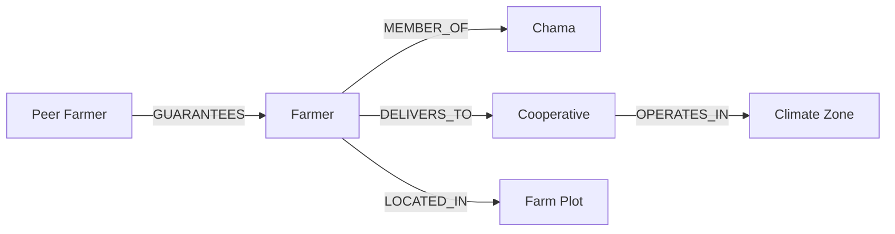

# KaLI Product Guide

> **Fair farmer credit, explained on SMS, grounded in the field.**

This guide explains what KaLI is, who it serves, and how each part of the platform fits together.

---

## The problem KaLI solves

Smallholder farmers in Kenya and Uganda are often excluded from credit because they lack:

- Formal banking history ("thin files")
- Land titles as collateral
- Smartphone apps or reliable internet

Yet many farmers **do** have trustworthy signals: years of cooperative delivery, chama savings, mobile money flows, and peer guarantees. KaLI reads those signals—and live climate risk—to produce **explainable credit scores** lenders can defend.


---

## Core idea: network resilience, not collateral

Traditional underwriting asks: *"What assets can we seize?"*

KaLI asks: *"How resilient is this farmer's network?"*



Every score is a **graph walk**—not an isolated spreadsheet row.

---

## Who uses KaLI


| Persona | Channel | Primary goal |
|---------|---------|--------------|
| **Farmer** | My Readiness portal, USSD, SMS | Understand score, follow advisory actions |
| **Loan officer** | Web dashboard + scorecard | Triage queue, decide, disburse |
| **Agronomist / field officer** | Field Intelligence platform | Verify mitigation on the ground |
| **Cooperative admin** | (Future) roster ingest | Feed delivery history into graph |

---

## Feature tour

### 1. My Readiness — farmer portal (public)

**Route:** `/readiness`

Farmers enter a **KTDA ID**, phone number, or national ID—no password.

| Element | What it shows |
|---------|----------------|
| Score ring | 0–100 readiness score (+ ground-truth bonus when verified) |
| Zone advisory | Active climate warning for their cooperative's zone |
| Action points | Concrete steps (from Featherless AI or score drags) |
| Strengths / gaps | What lenders already trust vs. what to build |

**Languages:** English, Kiswahili, Luganda.

**Demo:** `KTDA-43456789`

---

### 2. Officer dashboard — loan queue

**Route:** `/dashboard` (JWT required)

| Element | What it does |
|---------|--------------|
| Queue table | Live farmers from Neo4j, filter by segment/status |
| Portfolio stats | Approvals, climate flags, women/youth counts |
| Intake form | Officer-led application via unified ingest pipeline |
| Charts | Portfolio trends (synthetic in demo; API-ready) |

Officers search by name, ID, or cooperative and open a scorecard.

---

### 3. Explainable scorecard

**Route:** `/scorecard/:id`

The heart of underwriting. Each scorecard shows:

| Section | Description |
|---------|-------------|
| **Unified score** | Grow Asia + graph Cypher + optional ML blend |
| **Drivers** | Positive signals (co-op history, chama, guarantees) |
| **Drags** | Risk factors (climate stress, pest proximity, thin file) |
| **eSusFarm panel** | Side-by-side **farmer SMS** (≤160 chars) and **officer narrative** |
| **Climate context** | SPI, rainfall, pest km, active advisory |
| **Ground-truth loop** | Alert status, verifications, +8 mitigation driver |
| **Decision matrix** | Approve / Refer / Decline with stance + notes |
| **Masumi disburse** | Partner-tech payment intent (stub/live per env) |

---

### 4. East Africa map workspace

**Route:** `/map`

| Element | Description |
|---------|-------------|
| Leaflet map | Kenya + Uganda climate zones |
| Farmer pins | Risk-colored by score band |
| Zone click | Analytics + live Open-Meteo weather |
| SSE updates | Real-time pin refresh when graph changes |

---

### 5. Field Intelligence — agronomist platform

**Route:** `/agronomist`

ML-ranked queue of farmers who **self-reported** advisory actions but need **field verification**.

| Element | Description |
|---------|-------------|
| Stats cards | Pending verifications, urgent ML queue, active alerts |
| Zone filters | Focus visits by climate zone |
| Priority rings | 0–100 visit score (urgent / soon / routine) |
| Verify panel | Climate signals, ML drivers, tap-to-verify, field notes |

Verification writes `FieldVerification` nodes to Neo4j and unlocks the **+8 credit bonus**.

---

### 6. KaLI Agent + USSD

**Routes:** `/farmer` (simulator), `POST /ussd/ussd` (gateway)

| Menu | Action |
|------|--------|
| Register | Capture coop, crop, acreage via keypad |
| Check status | Application state from graph |
| Explain my score | Featherless SMS explainer in chosen language |
| Climate tip | Zone advisory for farmer's cooperative |

---

## Scoring engines (layered)

KaLI does not rely on a single black box. Scores are assembled in layers:

```mermaid
flowchart TB
  subgraph graph [Graph Cypher Engine]
    G1[Co-op delivery years]
    G2[Chama repayment]
    G3[Peer guarantee]
    G4[Climate SPI / pest]
    G5[Ground-truth bonus +8]
  end
  subgraph grow [Grow Asia Scoring]
    GA[System score + risk tier]
  end
  subgraph ml [ML Layer optional]
    ML[Logistic regression probability]
  end
  graph --> UN[Unified canonical score]
  grow --> UN
  ml --> BL[Blended 60/40 score]
  graph --> BL
```

| Band | Score | Recommendation |
|------|-------|----------------|
| **Approve** | ≥ 65 | Flexible crop alignment |
| **Refer** | 50–64 | Field audit committee |
| **Decline** | < 50 | Review drags |

---

## Ground-truth loop (why agronomists matter)


1. **Macro advisory** — climate pipeline flags a zone (drought, pest)
2. **Action plan** — farmer sees steps in My Readiness
3. **Self-report** — farmer marks action complete (stored in graph)
4. **Field verify** — agronomist confirms on farm
5. **Credit bonus** — scoring engine adds mitigation driver

See [GROUND_TRUTH_LOOP.md](./GROUND_TRUTH_LOOP.md) for technical detail.

---

## Explainability (eSusFarm pattern)

Every score can produce **two outputs** from the same context:

| Output | Audience | Format |
|--------|----------|--------|
| Farmer SMS | Smallholder | ≤160 characters, local language |
| Officer narrative | Branch auditor | Full sentence audit trail |

Powered by **Featherless AI** when `FEATHERLESS_API_KEY` is set; rule-based fallback otherwise.

---

## What's production-ready vs. demo

| Capability | Status |
|------------|--------|
| Neo4j graph scoring | ✅ Live |
| Officer JWT auth | ✅ Live |
| Dashboard + scorecard | ✅ Live |
| My Readiness portal | ✅ Live |
| Agronomist ML queue | ✅ Live |
| Map + Open-Meteo weather | ✅ Live |
| USSD backend | ✅ Live (simulator UI) |
| Featherless explainability | ✅ Live (with API key) |
| Real M-Pesa / telco SMS | 🔶 Stub / sandbox |
| Satellite / soil APIs | ❌ Not built |
| Live co-op roster ingest | 🔶 Manual seed / ingest API |

---

## Demo script (5 minutes)

1. **Landing** → click "Check my readiness" → enter `KTDA-43456789`
2. Complete an action point on readiness page
3. **Login** as officer → **Field** → verify the farmer
4. Open **scorecard F-1056** → see +8 ground-truth driver
5. Show **map** → click Kericho/Nyeri zone → weather panel
6. **USSD simulator** → menu 4 "Explain My Score"

---

## Related docs

- [User Journeys](./USER_JOURNEYS.md)
- [API Reference](./API_REFERENCE.md)
- [Deployment](./DEPLOYMENT.md)
