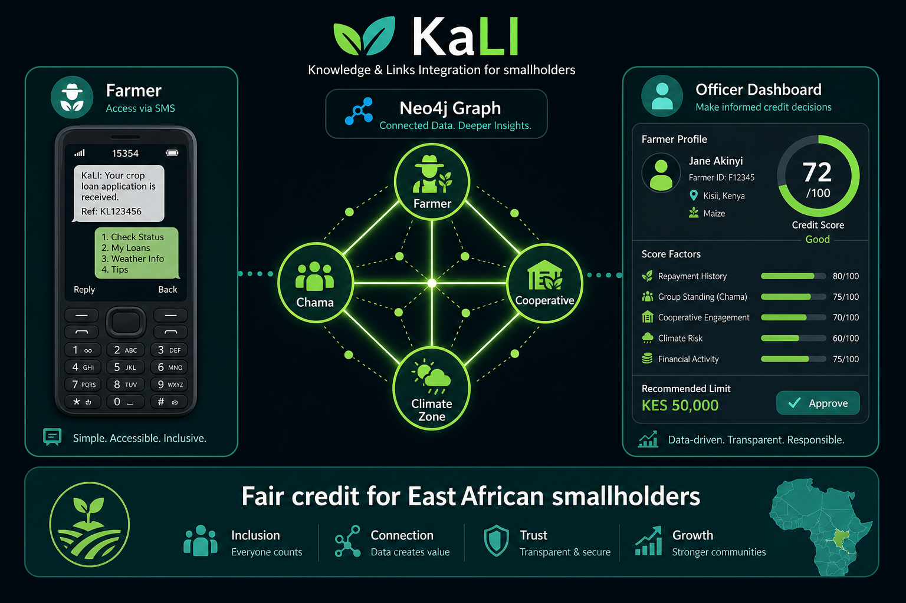
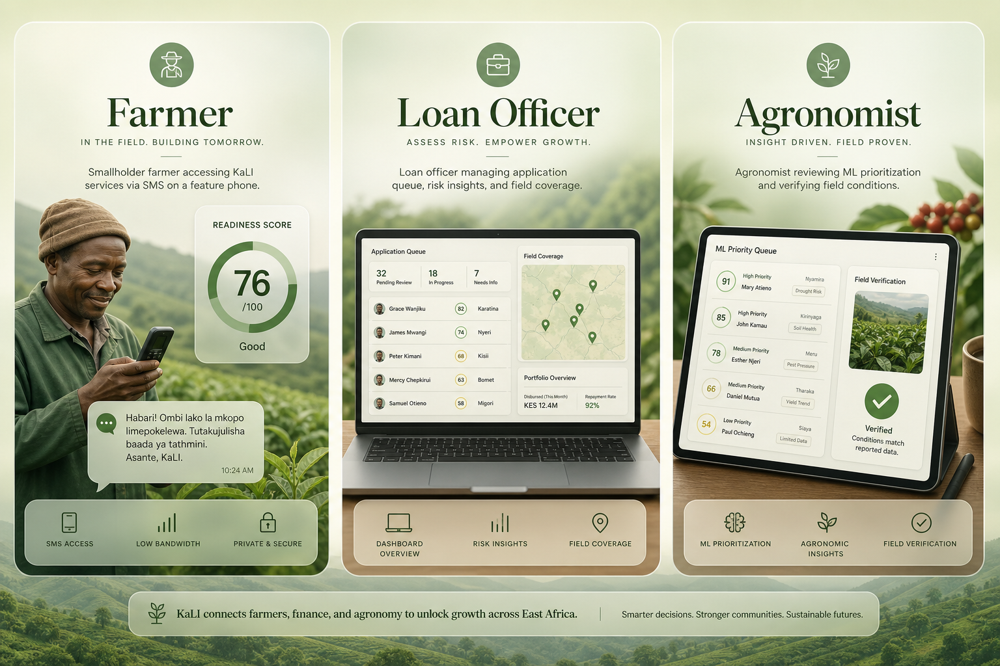
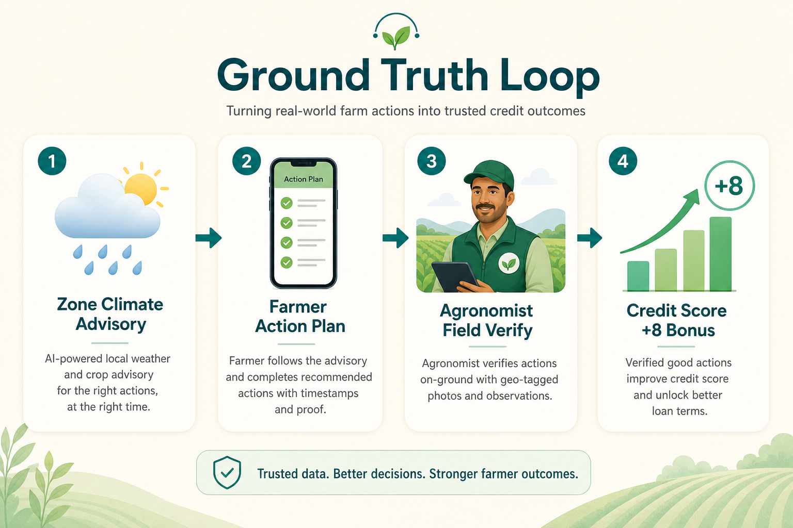

# KaLI Documentation

Welcome to the full documentation set for **KaLI** (Kenya / East Africa Agri **L**ending **I**ntelligence).

KaLI is a graph-native credit platform that helps lenders fairly score smallholder farmers using cooperative history, chama trust, mobile money signals, climate risk, and field-verified mitigation actions.

---

## Documentation map

| Document | Audience | Contents |
|----------|----------|----------|
| **[Product Guide](./PRODUCT_GUIDE.md)** | Investors, judges, product managers | What KaLI does, who it's for, feature tour with screenshots |
| **[User Journeys](./USER_JOURNEYS.md)** | UX, demos, onboarding | Step-by-step flows for farmer, officer, agronomist |
| **[Ground Truth Loop](./GROUND_TRUTH_LOOP.md)** | Technical + field partners | Advisory → action → verify → credit bonus |
| **[Architecture](./ARCHITECTURE.md)** | Engineers | Neo4j topology, scoring layers, API contracts |
| **[API Reference](./API_REFERENCE.md)** | Integrators | REST endpoints, auth, payloads |
| **[Deployment](./DEPLOYMENT.md)** | DevOps | Local dev, Render, Vercel, Neo4j Aura |

---

## Visual overview

### System at a glance

### Three personas

### Ground-truth credit loop

---

## One-paragraph pitch

KaLI replaces traditional collateral with **network resilience**: who the farmer delivers to, who guarantees them, how their chama saves, and whether their climate zone is under stress. Officers get explainable scorecards; farmers get SMS-ready guidance in **English, Kiswahili, and Luganda**; agronomists close the loop by verifying on-farm actions so credit scores reward real mitigation—not just self-reported checkboxes.

---

## Quick links (running locally)

| URL | Role |
|-----|------|
| [http://localhost:3000](http://localhost:3000) | Landing page |
| [http://localhost:3000/readiness](http://localhost:3000/readiness) | Farmer readiness (public) |
| [http://localhost:3000/auth](http://localhost:3000/auth) | Officer login |
| [http://localhost:3000/dashboard](http://localhost:3000/dashboard) | Loan queue |
| [http://localhost:3000/agronomist](http://localhost:3000/agronomist) | Field intelligence |
| [http://localhost:3000/map](http://localhost:3000/map) | Zone map + weather |
| [http://localhost:4000/api/health](http://localhost:4000/api/health) | API health |

**Demo farmer:** `KTDA-43456789` · **Demo officer:** `jane.mwangi@kali.co.ke` / `KaliBranch2026!`

---

## Repository entry points

- [Main README](../README.md) — install, scripts, quick start
- [Frontend README](../frontend/README.md) — routes and UI
- [Backend README](../backend/README.md) — API and Neo4j
