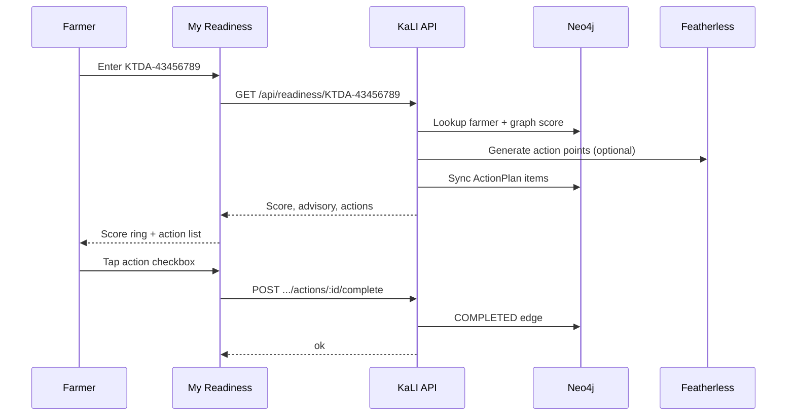
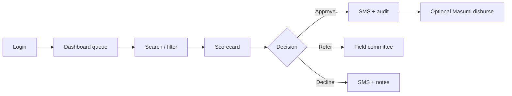
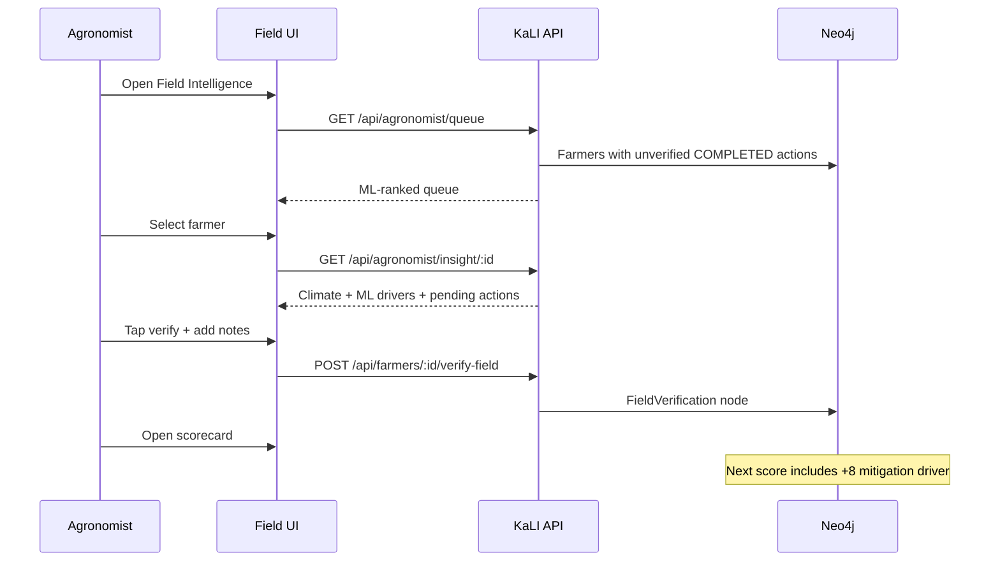
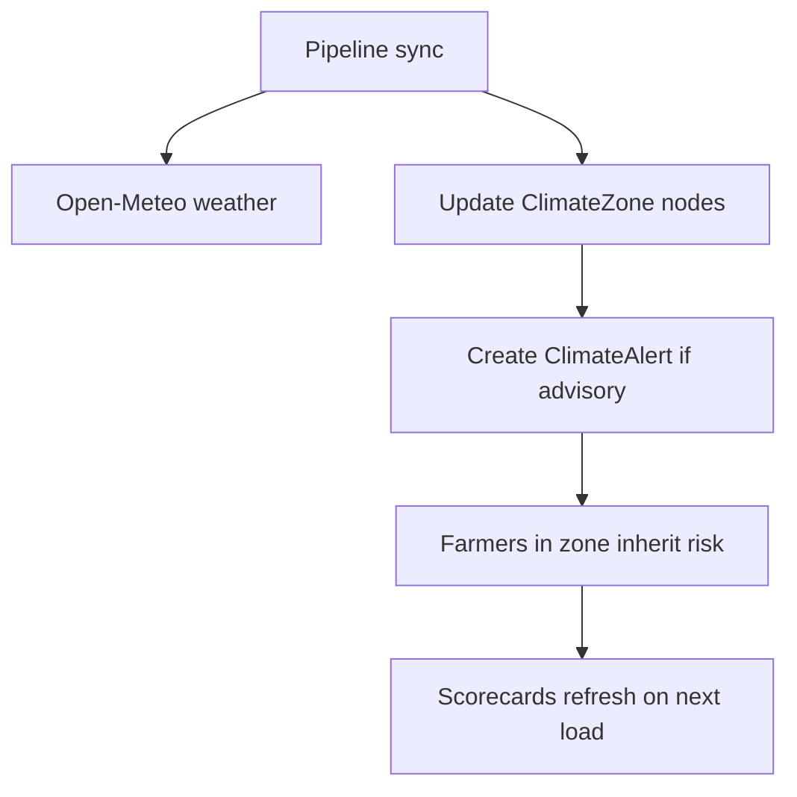

# KaLI User Journeys

Step-by-step flows for demos, onboarding, and UX review.

---

## Journey A — Farmer checks readiness

**Actor:** James Mburu, tea smallholder  
**Device:** Any phone browser (no app install)  
**Entry:** `/readiness` or landing page CTA

### Steps

1. Open **My Readiness** from home page or `/readiness`
2. Enter member number (`KTDA-43456789` for demo)
3. Choose language: English / Kiswahili / Luganda
4. Review:
   - Readiness score (0–100)
   - Zone advisory banner (if active alert)
   - SMS headline (saved from prior KaLI message)
   - Action points ranked by priority
5. Tap an action to mark it done — **persisted to Neo4j**
6. Optional: share member number with agronomist for field visit

### Success criteria

- Farmer understands score without officer visit
- At least one action marked complete
- Farmer sees "verified on farm" badge after agronomist confirms

---

## Journey B — Officer underwrites a loan

**Actor:** Jane Mwangi, branch loan officer  
**Device:** Desktop / tablet  
**Entry:** `/auth` → `/dashboard`

### Steps

1. Sign in at `/auth`
   - Demo: `jane.mwangi@kali.co.ke` / `KaliBranch2026!`
2. **Dashboard** — review queue, filter by Women/Youth/PWD
3. Click **Assess** → `/scorecard/F-1042` (or any farmer ID)
4. Review:
   - Drivers and drags with point values
   - eSusFarm dual panel (farmer SMS vs officer narrative)
   - Climate SPI, pest proximity, advisory
   - Ground-truth status
5. Select stance: Approve Flexible / Refer / Decline
6. Add notes → **Commit decision**
7. Farmer receives SMS node in graph (Africa's Talking when configured)

### Success criteria

- Officer can explain every ±point on the scorecard
- Decision persisted with audit trail
- SMS body visible in toast / logs

---

## Journey C — Agronomist verifies on farm

**Actor:** Field extension officer  
**Device:** Tablet  
**Entry:** `/agronomist`

### Steps

1. Login as officer (same JWT — field staff use officer auth today)
2. Sidebar → **Field** (`/agronomist`)
3. Review ML stats: pending, urgent, active alerts
4. Filter by zone if covering a specific region
5. Open highest-priority farmer card
6. In slide-over panel:
   - Read ML visit drivers
   - Confirm climate advisory context
   - Tap action to **verify on farm**
   - Add optional field notes
7. Open linked scorecard → refresh → see ground-truth driver

### Success criteria

- Queue shows farmers only after they self-report actions
- Verification removes farmer from pending queue
- Credit score reflects mitigation bonus on next assessment

---

## Journey D — USSD on feature phone

**Actor:** Farmer without smartphone  
**Device:** Feature phone dial pad  
**Entry:** `*483*100#` (simulator at `/farmer`)

### Steps

1. Dial USSD code
2. Select language (EN / SW / LG)
3. Menu options:
   - Register new application
   - Check application status
   - Request input credit
   - **Explain my score** (Featherless SMS)
4. Session ends; SMS summary logged in graph

### Backend path

`POST /ussd/ussd` → `ingestController` → Neo4j farmer upsert → scoring context

---

## Journey E — Climate sync affects portfolio

**Actor:** System / ops  
**Trigger:** `POST /api/pipeline/sync` or `npm run climate:sync`

When a zone SPI drops or pest proximity tightens, every farmer connected via `DELIVERS_TO → OPERATES_IN` sees updated drags on their next scorecard.

---

## Cross-journey integration map

| From | To | Graph edge / API |
|------|-----|------------------|
| Farmer readiness | Agronomist queue | `COMPLETED` without `FieldVerification` |
| Agronomist verify | Officer scorecard | `GROUND_TRUTH` → `CONFIRMS` → +8 driver |
| Climate pipeline | Farmer readiness | `ClimateAlert` → `ActionPlan` |
| Officer decision | Farmer SMS | `SmsMessage` node |
| USSD ingest | Dashboard queue | New/updated `Farmer` node |

---

## Demo credentials

| Role | Credential |
|------|------------|
| Farmer lookup | `KTDA-43456789` (James Mburu, F-1056) |
| Officer | `jane.mwangi@kali.co.ke` / `KaliBranch2026!` |
| Sample scorecard | `/scorecard/F-1042` (Mary Wanjiku) |
